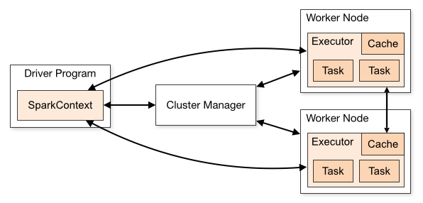
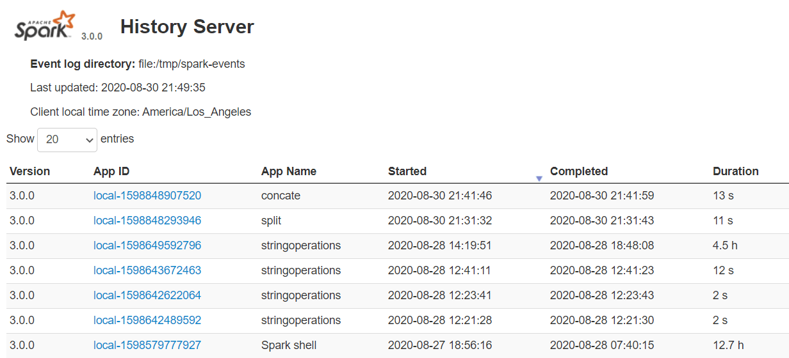

# jaraghe

I use this project to learn Spark and newer technologies, this is not in code 101 because I usually come back to the 
codes and file like this and finding a repository is much easier than finding a file in a big repository.

# What is pyspark
PySpark is a Python API for Apache Spark. Apache Spark is an analytical processing engine for large scale powerful 
distributed data processing and machine learning applications.

# What is Py4J
Spark is written in Scala and later due to its industry adaption Pypspark released for Python using Py4J. Py4J is a 
java library that is integrated within Pyspark and allows python to dynamically interface with JVM objects, hence to run 
PySpark you also need java to be installed along with Python and Apache Spark.

# Features and advantages

# Architecture
It is master-slave where the master is called "Driver" ans slaves are called "Workers". Spark Driver creates a context 
that is an entry point to your application, and all operations are executed on worker nodes, and the resources are 
managed by Cluster Manager.





# Cluster Manager Types

1.Standalone
2.Mesos
3.YARN
4.**Kubernetes**

5.local: not really a cluster manager, but we use it to run Spark on laptop

# Install and Run Spark
I think downloading and installing anything that can be used by a docker container is not wise so here's what I did: <br/>
```shell
docker pull bitnami/spark
docker run bitnami/spark
docker exec -it [docker-name] /bin/bash
./bin/pyspark
```

# Interactive Analysis with the Spark Shell
Let's make a new DataFrame from the text of the README file in the Spark source directory
```shell
textFile = spark.read.text("README.md")
```

Number of rows in this Dataframe
```shell
textFile.count()
```
First row in this DataFrame
```shell
textFile.first()
```
Filter returns a new DataFrame with a subset of the lines in the file
```shell
linesWithSpark = textFile.filter(textFile.value.contains("Spark"))
```
We can chain together transformations and actions:
```shell
textFile.filter(textFile.value.contains("Spark")).count()
```

# More Complex Operations on Datasets
Find the line with the most words<br/>

```shell
from pyspark.sql.functions import *
textFile.select(size(split(textFile.value, "\s+")).name("numWords")).agg(max(col("numWords"))).collect()
```

**Spark can implement MapReduce flow easily**
```shell
wordCounts = textFile.select(explode(split(textFile.value, "\s+")).alias("word")).groupBy("word").count()
```
Here, we use the `explode` function in `select`, to transform a Dataset of lines to a Dataset of words, and then combine
`groupBy` and `count` to compute the per-word in the file as a DataFrame of 2 columns: "word" and "count". To collect the 
word counts in our shell, we can call `collect`

```shell
wordCounts.collect()
```

# Caching
```shell
linesWithSpark.cache()
```

# Spark History Server
Spark History servers, keep a log of all Spark application you submit by spark-submit



# RDD

